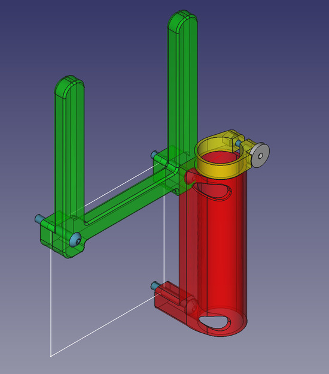
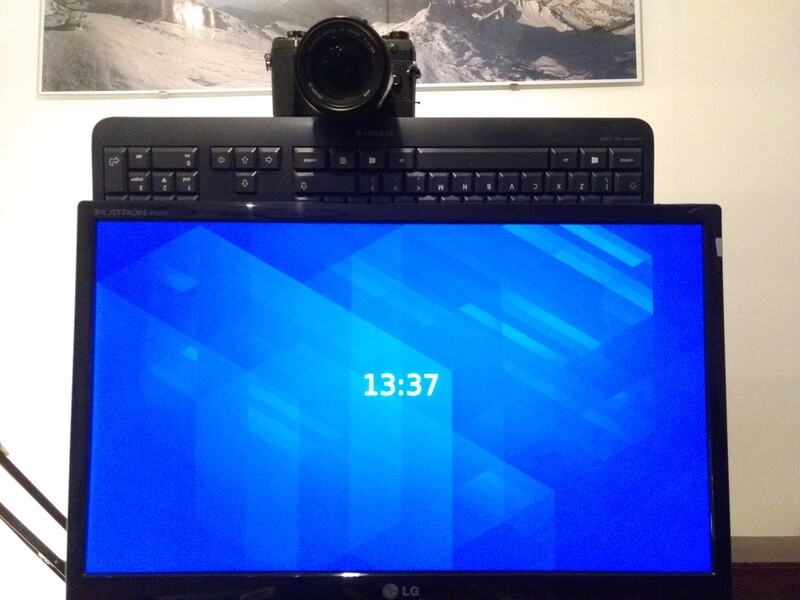
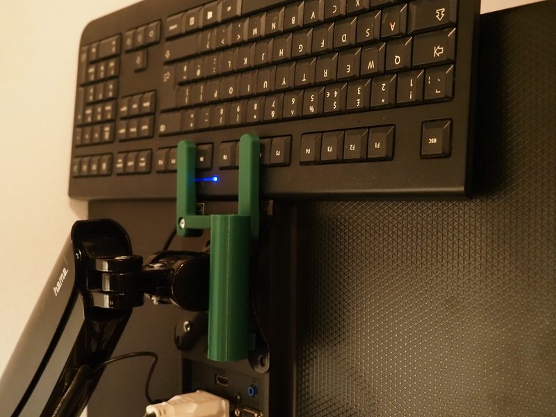
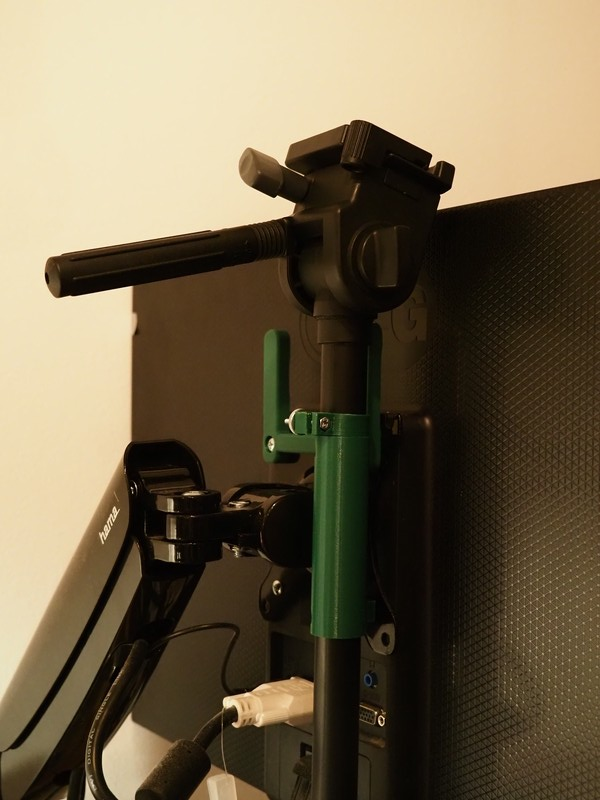

# VESA-Mount Monitor Attachments

Set of attachments that can be attached to a 75mm or 100mm VESA-Mount on the back of a monitor.

The Freecad design is now parametric. Use can use the assembly variables d_VESA and keyboard_offet to adjust the VESA grid size and height of the spacers.

## Keyboard Holder

Required nuts & screws:
Longer screws for your VESA-mount. Probably:

* 2x M4x20

## 21mm Tripod Camera Mount Adapter

Required nuts & screws:

* 1x M3x20 hex head
* 1x M3 knurled nut (for easy adjustments without tools. A normal will also do)
* 1 extra M4 (same as for keyboard holder)
